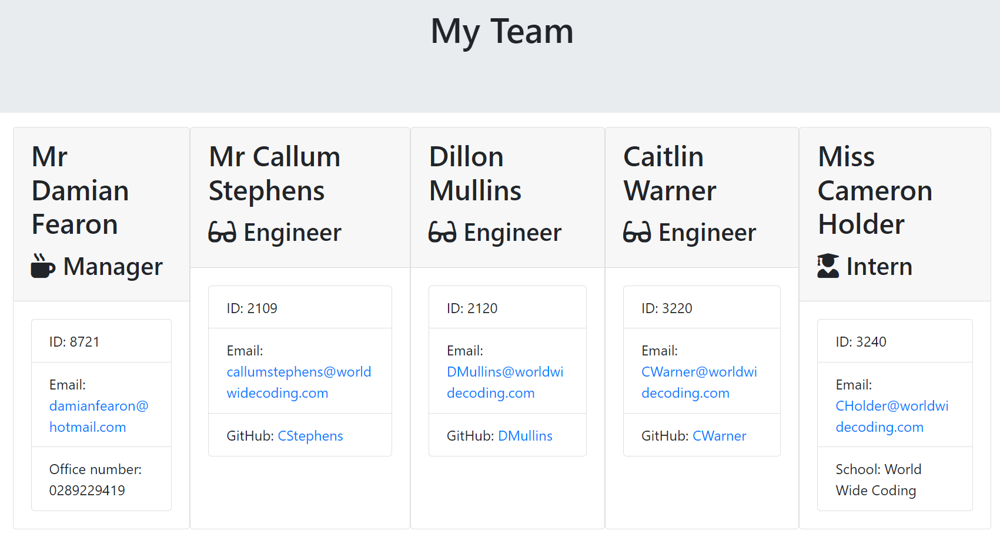

<h1>Team Profile Generator</h1>

[Deployed Site](https://damianfearon.github.io/Simple-Workday-Planner/) 
[Github Repo](https://github.com/damianfearon/Team-Profile-Generator) 
[HTML](https://github.com/damianfearon/Team-Profile-Generator/blob/main/output/team.html) 

<h3>Screenshot</h3>
 <h3> Preview of the Team Profile Generator </h3>
  
  
  

<h2>Team Profile Generator </h2> 
  Your task is to take the given starter code and convert it into a working Node.js command-line application. This application will take in information about employees on a software engineering team, then generates an HTML webpage that displays summaries for each person. You have been provided with tests, so make sure every part of your code passes each provided test.  
 
<h2>User Story</h2>
<ul>
  As a manager a user want to generate a webpage that displays my team's basic info so that a user have quick access to their emails and GitHub profiles.  

 
<h2>Instructions</h2>
Create a command-line application that accepts accepts user input using the provided starter code.
<ul>

<li>Create classes for each team member provided and export them. The tests for these classes (in the _tests_ directory) must ALL pass.
</li>

<li>The first class is an Employee parent class with the following properties and methods:
</li>

<li>Name</li>
<ul>
<li>id
<li>email</li>
<li>getName()</li>
<li>getId()</li>
<li>getEmail()</li>
<li>getRole - returns 'Employee'</li> </ul> 
</ul>

<h2>Grading Requirements</h2>
  
<h3>Deliverables: 25%</h3>
<li>A sample HTML file generated using the application must be submitted.</li>
<li>Your GitHub repository containing your application code.</li>

<h3>Technical Acceptance Criteria: 50%</h3>

<ul>

Satisfies all of the above acceptance criteria plus the following:

<li>Uses the Inquirer package.</li>
<li>All tests pass using the Jest package.</li>
<li>The application must have Employee, Manager, Engineer and Intern Classes. 

<h3>Repository Quality: 25%</h3>

<ul>

<li>Repository has a unique name</li>

<li>Repository follows best practices for file structure and naming conventions</li>

<li>Repository follows best practices for class/id naming conventions, indentation, quality comments, etc.</li>

<li>Repository contains multiple descriptive commit messages</li>

<li>Repository contains a high-quality readme with description.

</li>
</ul>
  
<h2>Review</h2>
<ul>
You are requiired to submit the following for review:
<li>A sample HTML file generated using your application.</li>
<li>The URL of the GitHub repository, with a unique name and a readme describing the project.</li>

